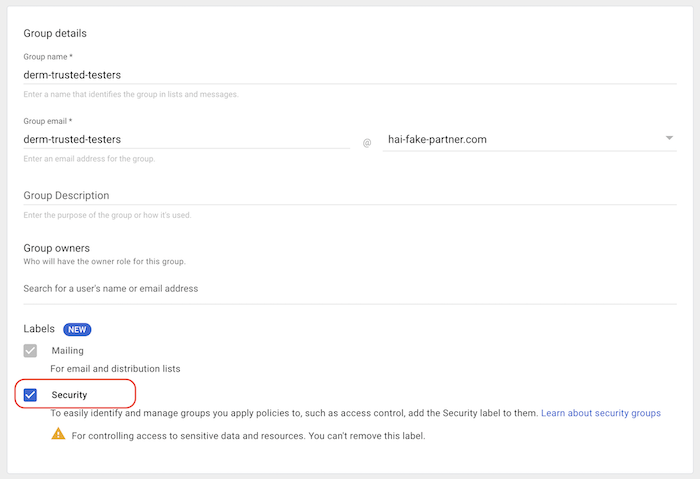
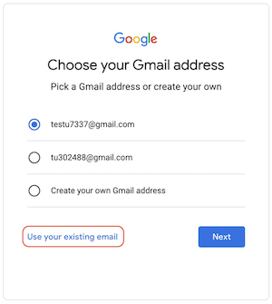

# CT Foundation

**CT Foundation** is a tool that enables users to transform Computed Tomography
(CT) volumes comprised of axial slices into an information-rich vector
representation known as an
[embedding](https://developers.google.com/machine-learning/crash-course/embeddings/video-lecture).
These embeddings can be used to develop custom machine learning models for task
specific use-cases using less data and compute compared to traditional model
development methods.

## How to use the CT Foundation API

1.  Decide if you want to get access as an individual or a group. For more
    information see [Access Options](#access-options)

1.  With the Google identity from the previous step at hand, fill out the
    [API access form](https://docs.google.com/forms/d/e/1FAIpQLSfkSBbCi5dOlJxuDB3t6biFEBIA9JL66A99YRZa8qR2Fn5mUA/viewform?resourcekey=0-vPNR0VQ-vibGDJ564j4mCA).

1.  Once access is granted, you’ll be notified via the provided email address
    and can start using the API.

1.  Use the
    [Demo Notebook](https://colab.research.google.com/github/Google-Health/imaging-research/blob/master/ct-foundation/CT_Foundation_Demo.ipynb)
    to see how to use the API to compute embeddings and how to train a sample
    classifier. You can experiment with
    [our sample CT images & training labels](#use-our-test-data) to understand
    the API, then modify the Colab to use [your own data](#use-your-own-data).

The demo Colab includes instructions for:

*   Generating a temporary access token for the API to read the DICOM images
    from a
    [Cloud DICOM Store](https://cloud.google.com/healthcare-api/docs/concepts/dicom)
    on behalf of the person running the Colab.
*   Calling the API on CT scans stored in Cloud DICOM Store to generate
    embeddings
*   Training a linear classifier for lung cancer using pre-computed embeddings
    on [NLST](https://www.cancerimagingarchive.net/collection/nlst/)
*   Evaluating the result of this classifier.

[Contact us](#contact) if you have questions or need help.

## Use our test data

Upon gaining access to CT Foundation, you'll also have access to publicly
available data we've curated specifically for testing. This includes CT studies
from the [LIDC-IDRI](https://www.cancerimagingarchive.net/collection/lidc/)
dataset stored in a
[Google Cloud DICOM Store](https://cloud.google.com/healthcare-api/docs/concepts/dicom).
We also store pre-computed embeddings run on CT Foundation from
[NLST](https://www.cancerimagingarchive.net/collection/nlst/) Our
[Demo Notebook](https://colab.research.google.com/github/Google-Health/imaging-research/blob/master/ct-foundation/CT_Foundation_Demo.ipynb)
shows you how to call CT Foundation on the LIDC_IDRI DICOMS and also how to
train a performant model using the precomputed NLST embeddings.

## Use your own data

WARNING: You hold responsibility for the data that you use with the API. It's
important to comply with all the terms of use your data is subject to.

NOTE: The current version of the API expects the CT images in a
[Google Cloud DICOM Store](https://cloud.google.com/healthcare-api/docs/concepts/dicom).
This section provides instructions how to get your data to a Cloud DICOM Store
that you own. If you need support for complying with your Cloud enterprise
policies, [Contact us](#contact). We're happy to help!

NOTE: The demo Colab demonstrates how to call the API using short-lived access
tokens. These tokens permit the API to read and process the images on behalf of
the individual who is running the Colab. It's important to note that the API
cannot access your data independently. The API processes images when you
instruct it to using a time-limited access token and does not store the images
after processing.

To use your own data with the API, you will need the following GCP resources:

*   A [GCP Project](https://cloud.google.com/storage/docs/projects)
*   A
    [Google Cloud DICOM Store](https://cloud.google.com/healthcare-api/docs/concepts/dicom)
    in the project for storing CT images
*   A GCS bucket in the project for staging dicoms before adding them to DICOM
    Store. This can also be used to store data labels to train your downstream
    model.

1.  If you don't have access to an existing GCP Project, you will need to
    [create one](https://cloud.google.com/free).

    1.  Follow
        [these instructions](https://cloud.google.com/storage/docs/creating-buckets)
        to create the GCS bucket.

    1.  Follow
        [these instructions](https://cloud.google.com/healthcare-api/docs/how-tos/dicom)
        to create a Cloud DICOM Store.

    1.  Use [Google Cloud IAM panel](https://console.cloud.google.com/iam-admin)
        to grant the following permissions to the GCP resources:

    *   Allow the individual running the rest of the steps to manage objects in
        the GCS bucket by granting them the predefined role
        `roles/storage.objectAdmin`.

    *   Allow
        [the identity(ies) who have access to our API](#how-to-gain-access) to:

        *   read training labels and persist embeddings in the GCS bucket by
            granting them the predefined role `roles/storage.objectAdmin`.
        *   read DICOM images from the Cloud DICOM Store by granting them the
            predefined role `roles/healthcare.dicomViewer`.

1.  On your local machine
    [install the gcloud SDK](https://cloud.google.com/sdk/docs/install) and
    [log in](https://cloud.google.com/sdk/gcloud/reference/auth/login):

    ```
    gcloud auth application-default login
    ```

1.  From your local machine use the
    [gcloud storage commands](https://cloud.google.com/sdk/gcloud/reference/storage)
    to transfer  DICOM files in .dcm format to
    the GCS bucket. You may use the
    [`rsync` command](https://cloud.google.com/sdk/gcloud/reference/storage/rsync)
    instead of `cp` to handle larger volume of files. You can also optionally add labels to train downstream models.

1.  Follow
    [these instructions](https://cloud.google.com/healthcare-api/docs/how-tos/dicom-import-export#gcloud)
    to bulk import DICOM files from the GCS bucket to your Cloud DICOM Store.

1.  Modify the
    [Demo Notebook](https://colab.research.google.com/github/Google-Health/imaging-research/blob/master/ct-foundation/CT_Foundation_Demo.ipynb)
    to point to your data:

1.  If storing your labels in GCS replace `hai-cd3-foundations-ct3d-vault-entry`
    with the name of your GCS bucket. Otherwise import them into the Notebook from wherever you are storing them.

1.  To use your DICOM images, change the the Cloud DICOM Store urls. They take
    the following format:
    `https://healthcare.googleapis.com/v1/projects/YOUR_PROJECT_ID/locations/YOUR_LOCATION/datasets/YOUR_DATASET_ID/dicomStores/YOUR_DICOM_STORE_ID/`.
    You need to substitute `YOUR_PROJECT_ID` with the project Id you obtained in
    step 1 and `YOUR_LOCATION`, `YOUR_DATASET_ID`, `YOUR_DICOM_STORE_ID` from
    step 3.

## Access Options

You have the option to request access to the API either as
[an individual](#as-an-individual-non-gmail-account) or for
[a group](#as-a-group-recommended). Choose the process that best aligns with
your needs. Remember to note the email identifier for which you will be
requesting access. It should be in one of these formats:

*   YOUR-GROUP-NAME@YOUR-DOMAIN
*   INDIVIDUAL-ID@YOUR-DOMAIN
*   INDIVIDUAL-ID@gmail.com

### As a group (recommended)

If your organization is a Google Workspace or Google Cloud Platform (GCP)
customer, contact your Google admin and ask them to create a group with the list
of individuals who will be using the API. Let them know that this group is used
for contacting you and also as a security principal for authorizing your access
to the API.



Otherwise,
[create a free Cloud Identity Account](https://cloud.google.com/identity/docs/set-up-cloud-identity-admin)
for your domain name and in the process become the interim Google admin for your
organization. Visit [Google Admin console](https://admin.google.com/) and create
the above-mentioned group. If your individual identities are unknown to Google,
they will need to follow the process for the [individuals](#as-an-individual)
before you can add them to the group.

### As an individual (non-gmail account)

This section applies for the INDIVIDUAL-ID@YOUR-DOMAIN case (e.g.
`person@university.org` or `person@company.com`)

If your organization is a Google Workspace or GCP customer, identity federation
is most likely set up between your corporate identity directory and
[Google Identity and Access Management](https://cloud.google.com/security/products/iam)
and therefore individuals already have Google identities in the form of their
corporate emails. Check with your IT department to find out whether identity
federation is already in place or will be established soon.

Otherwise,
[create a Google identity based on your email](https://accounts.google.com/signup/v2/webcreateaccount?flowName=GlifWebSignIn&flowEntry=SignUp).
Opt for the "use my current email address instead" option, as shown in the
screen capture below.

IMPORTANT: You should choose a password that is different from the password you
use for the email account.



### As an individual (`@gmail.com` account)

If you want to sign up as an individual with a gmail account, you can submit the
form directly with your gmail address.

## General notes

*   Google does not keep a copy of any DICOM images processed.
*   Google monitors daily query volume and aggregates on a per-user and
    per-organization basis. Access can be revoked if a user or organization
    exceeds a reasonable query volume.

## Contributing

See [`CONTRIBUTING.md`](CONTRIBUTING.md) for details.

## License

See [`LICENSE`](LICENSE) for details.

## Contact

Please reach out to us at
[ct-foundation@google.com](mailto:ct-foundation@google.com]) for issues such as,
but not limited to:

-   Seeking technical assistance
-   Providing feedback
-   Requesting permissions for publications
-   Discussing clinical use cases
-   Discussing enterprise requirements such as:
    -   Fitting within strict security perimeters of your organization
    -   Governing your data in GCS
    -   Training and serving custom models at scale on
        [Vertex AI](https://cloud.google.com/vertex-ai?hl=en)

# Model Card for CT Foundation

This section briefly overviews the background and limitations of CT Foundation.

## Model Details
### Overview

CT Foundation produces embeddings of size 1408 from a CT volume. Embeddings are
n-dimensional vectors of floating points representing a projection of the
original image into a compressed feature space capable of describing image
features relevant to CT image analysis. The model is based on the
[Video CoCa architecture](https://arxiv.org/abs/2212.04979). CT Foundation was
trained in two stages.

*   Firstly train a medical image–specific 2D CoCa model
*   Use this 2D model as a basis for VideoCoCa. Training on specifically
    prepared axial CT slices (series of CT slices in a scan) coupled with
    radiology reports.

The resulting feature representations provided by CT Foundation offer robust
input for downstream tasks in CT image analysis. Additional information on our
evaluation tasks can be found in our
[blog post](https://research.google/blog/taking-medical-imaging-embeddings-3d).

### Version

```
name: v1.0.0
date: 2024-10-18
```

### Owners

```
ct-foundation@google.com
```

### License

Research use only. Not suitable for product development. - See
[CT Foundation - Additional Terms of Service](https://docs.google.com/forms/d/e/1FAIpQLSfkSBbCi5dOlJxuDB3t6biFEBIA9JL66A99YRZa8qR2Fn5mUA/viewform?resourcekey=0-vPNR0VQ-vibGDJ564j4mCA).

### Intended Use

*   CT Foundation can reduce the training data, compute, and technical expertise
    necessary to develop task-specific models based on Computed Tomography
    Scans.
*   Embeddings from the model can be used for a variety of user-defined
    downstream tasks across different CT studies of various body parts. Validation includes lung
    cancer identification within chest CTs, aortic aneurysm in abdominal CTs,
    hemorrhage within head CTs. The model can also be used to classify different
    CT studies by body part or image quality.

### Training Data

A comprehensive private dataset comprising 527,078 CT studies with associated
radiology reports from 430,772 patients was obtained from three major hospital
regions in the United States.

### Validation

Evaluation was conducted across a diverse set of 7 benchmarking tests using
non-linear
[multilayer perceptrons](https://en.wikipedia.org/wiki/Multilayer_perceptron).
These tasks were related to classifying: intracranial hemorrhage, calcifications
in the chest and heart, lung cancer prediction in the chest, suspicious
abdominal lesions, urolithiasis, and abdominal aortic aneurysm in abdominopelvic
CTs. Results can be found in our
[blog post](https://research.google/blog/taking-medical-imaging-embeddings-3d).

### Risks

Although Google does not store any data sent to this model, it is the data
owner's responsibility to ensure that Personally identifiable information (PII)
and Protected Health Information (PHI) are removed prior to being sent to the
model. Mitigation Strategy: Do not send data containing PII or PHI. Training
dataset is a de-identified public dataset and CT imaging (pixel data) does not
contain PHI.

### Limitations

This is a research model and is intended for research purposes only. It has not
been extensively validated across different scanner manufacturers. As with any
research, developers should ensure any downstream application is validated to
understand performance using data that is appropriately representative of the
intended use setting (e.g., age, sex, gender, condition, scanner, etc.).
