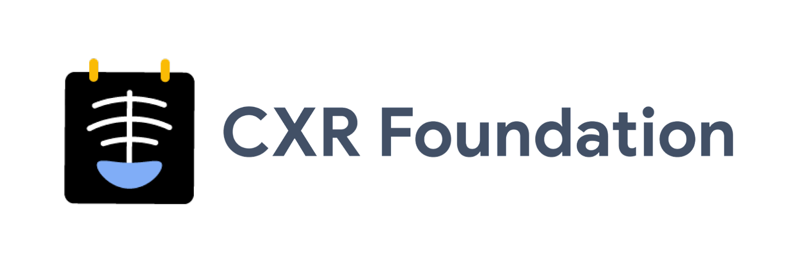

**CXR Foundation** is a tool to generate custom embeddings from chest x-ray (CXR) images. These embeddings can be used to develop custom machine learning models for CXR with less data and compute. You can read more about the research behind CXR Foundation in our recent publication: [Simplified Transfer Learning for Chest Radiography Models Using Less Data](https://doi.org/10.1148/radiol.212482).

## How to use CXR Foundation

1. Fill out the [API access form](https://forms.gle/SJBSawfDw19JZRA59). Your provided Gmail account will be used for access once approved for non-clinical use.
2. Once granted you’ll get an email and can use the CXR Foundation API with your own images.
3. You also have access to this GitHub repository containing Python source code to: 
    1. Convert DICOM images into PNGs suitable for calling CXR Foundation
    2. Call the API to generate embeddings from the PNG
    3. Train a model given a set of embeddings and corresponding ground truth
4. [Install the gcloud CLI](https://cloud.google.com/sdk/docs/install) and login

	  1. Open a command line and login. This will automatically accept the [Google Cloud Platform TOS](https://cloud.google.com/terms).

			gcloud auth application-default login
5. Clone the Repository into a local directory

		git clone https://github.com/Google-Health/imaging-research
		cd imaging-research/cxr-foundation

6. Install the CXR Foundation libraries in a virtual environment
       
        python -m venv env
        source env/bin/activate
        pip install -r requirements.txt
        pip install .

7. Run the CXR Foundation code in your local/cloud environment and start training
    1. Upload your chest x-ray DICOMs or PNGs to a cloud bucket or use a local directory
    2. Generate and export embeddings, for example:

			python -m run_inference --input_path "gs://your/cloud/bucket/inputs/" --output_path "gs://your/cloud/bucket/outputs/" --embeddings_project gh-rad-validation-cxrembd-deid --endpoint_id 6695981832690728960 --limit 5 --input_file_type='dicom'

    3. Train on the embeddings, for example (see source code for details on CSV format and args):

			python -m train --train_split_name train --tune_split_name tune --labels_csv labels.csv --head_name EFFUSION --data_dir ~/your/local/dir/ --num_epochs 30

8. Have questions? Email [cxr-foundation@google.com](mailto:cxr-foundation@google.com).

**Notes**: 

*   Google does not keep a copy of any images sent.
*   Google monitors daily query volume and aggregates on a per-user and per-organization basis. Access can be revoked if a user or organization exceeds a reasonable query volume.
*   If you consented to follow-up, Google may reach out for feedback.
*   Please use the following reference for any published work:
    *   Sellergren A, Chen C, et al. Simplified Transfer Learning for Chest Radiography Models Using Less Data. Radiology. 2022.

## Contributing

See [`CONTRIBUTING.md`](CONTRIBUTING.md) for details.

## License

See [`LICENSE`](LICENSE) for details.

## Disclaimer
THIS SOFTWARE IS PROVIDED BY THE COPYRIGHT HOLDERS AND CONTRIBUTORS "AS IS" AND ANY EXPRESS OR IMPLIED WARRANTIES, INCLUDING, BUT NOT LIMITED TO, THE IMPLIED WARRANTIES OF MERCHANTABILITY AND FITNESS FOR
 A PARTICULAR PURPOSE ARE DISCLAIMED. IN NO EVENT SHALL THE COPYRIGHT OWNER OR CONTRIBUTORS BE LIABLE FOR ANY DIRECT, INDIRECT, INCIDENTAL, SPECIAL, EXEMPLARY, OR CONSEQUENTIAL DAMAGES (INCLUDING, BUT NOT LIMITED TO, PROCUREMENT OF SUBSTITUTE GOODS OR SERVICES; LOSS OF USE, DATA, OR PROFITS; OR BUSINESS INTERRUPTION) HOWEVER CAUSED AND ON ANY
 THEORY OF LIABILITY, WHETHER IN CONTRACT, STRICT LIABILITY, OR TORT
 (INCLUDING NEGLIGENCE OR OTHERWISE) ARISING IN ANY WAY OUT OF THE USE
 OF THIS SOFTWARE, EVEN IF ADVISED OF THE POSSIBILITY OF SUCH DAMAGE.

# Model Card for CXR Foundation

## Model Details

### Overview

This model generates embeddings for chest x-rays (CXRs). Embeddings are n-dimensional vectors of floating points representing a projection of the original image into a compressed feature space capable of describing potential abnormalities that exist in the image. These embeddings are to be used by “downstream models” for final tasks such as detecting a particular abnormality in a CXR. The model uses the EfficientNet-L2 architecture (https://arxiv.org/pdf/1911.04252v4.pdf). It was trained on 821,544 CXRs from India and the US using abnormal vs. normal labels, i.e. the image contained any kind of abnormality, and the Supervised Contrastive loss (https://arxiv.org/abs/2004.11362v1). The abnormal vs. normal labels were obtained from more granular labels (e.g. pneumothorax, fracture) as well as regular expressions on radiology reports (https://pubmed.ncbi.nlm.nih.gov/34471144/).

### Version

    name: v1.0
    date: 2022-07-19

### Owners

    Andrew Sellergren, asellerg@google.com

### Licenses

*   See [CXR Foundation - Additional Terms of Service](https://forms.gle/SJBSawfDw19JZRA59).

### References

*   https://arxiv.org/pdf/1911.04252v4.pdf
*   https://arxiv.org/pdf/1912.11370.pdf
*   https://arxiv.org/abs/2004.11362v1
*   https://pubmed.ncbi.nlm.nih.gov/34471144/

###  Citations

*   Sellergren A, Chen C, et al. Simplified Transfer Learning for Chest Radiography Models Using Less Data. Radiology. 2022.

## Considerations

### Use Cases

*   Embeddings can reduce barriers to entry for training custom models with less data, setup, and compute.
*   Embeddings can allow for quick evaluation.

### Limitations

*   The model was trained using only data from the US and India and may not generalize well to data from other countries, patient populations, or manufacturers not used in training.
*   The model is only used to generate embeddings of the user-owned dataset. It does not generate any predictions or diagnosis on its own.

### Ethical Considerations

*   Risk: Although Google does not store permanently any data sent to this model, it is the data owner's responsibility to ensure that Personally identifiable information (PII) and Protected Health Information (PHI) are removed prior to being sent to the model. \
*   Mitigation Strategy: Do not send data containing PII or PHI.
