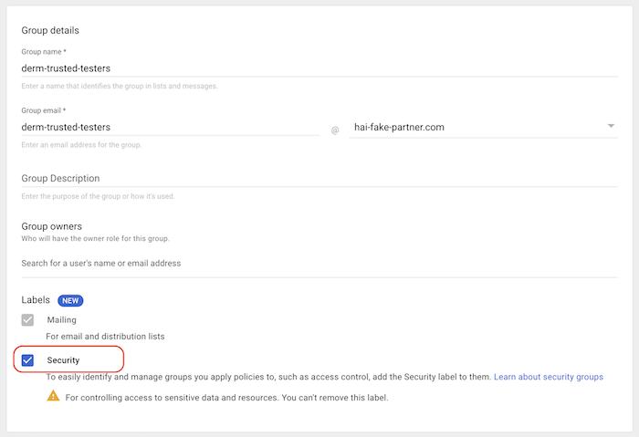

# Path Foundation

Path Foundation is a tool that enables users to transform pathology images into
a machine learning representation of the images known as embeddings. Embeddings
are a list of floating point values that represent a projection of the original
image into a compressed feature space. This tool utilizes a model trained via
self-supervised learning (see [model card](#model-card-for-path-foundation-model) below) in order to create embeddings
for image patches from histopathology whole slide images (WSIs). These
embeddings can be used to develop custom machine learning models for pathology
use-cases using less data and compute compared to traditional model development
methods.

For more information please see this [video](https://www.youtube.com/watch?v=Q_09Kqv1y1E).

You can read more about the research and underlying model in our
manuscript:
[Domain-specific optimization and diverse evaluation of self-supervised models for histopathology](https://arxiv.org/abs/2310.13259).

## How to use the Path Foundation API

1.  Decide if you want to get access as an individual or a group. For more information see [Access Options](#access-options)

1. With the individual or group email identity at hand from the previous step,
fill out the [API access form](http://bit.ly/fm-path-access-form).

1.  Once access is granted, you’ll be notified via the provided email address
    and can start using the API.

1. The [Demo Colab](https://colab.research.google.com/github/Google-Health/imaging-research/blob/master/path-foundation/linear-classifier-demo.ipynb) shows you how
to train a sample linear classifier. You can experiment with
[our sample digitized pathology images & training labels](#use-our-test-data)
to understand the API, then modify the Colab to use
[your own data](#use-your-own-data).

The Colab includes instructions for:

* Generating training labels in JSON format from masks in PNG format.
* Generating a temporary access token for the API to read the DICOM images
from a [Cloud DICOM Store](https://cloud.google.com/healthcare-api/docs/concepts/dicom)
on behalf of the person running the Colab.
* Calling the API on WSI DICOMs stored in Cloud DICOM store to generate embeddings
* Training a linear classifier using these embeddings and training labels from a
[Cloud Storage (GCS) bucket](https://cloud.google.com/storage) and evaluating the result of this classifier.
* An alternative way of calling the API to generate embeddings from digital pathology images (JPEG, TIFF or PNG) stored in GCS

We have a [video walkthrough](https://www.youtube.com/watch?v=Q_09Kqv1y1E) of the demo if you'd like more information.
[Contact us](#contact) if you find training your custom model is more
involved and requires more advanced batching. We're happy to help!

## Use our test data

Upon gaining access to the API, you'll also have access to publicly available
data we've curated specifically for testing on the [Demo Colab](https://colab.research.google.com/github/Google-Health/imaging-research/blob/master/path-foundation/linear-classifier-demo.ipynb). This data comprises of DICOM images stored in a Google Cloud DICOM Store and training labels in PNG and JSON formats in a GCS bucket. The [Demo Colab](https://colab.research.google.com/github/Google-Health/imaging-research/blob/master/path-foundation/linear-classifier-demo.ipynb)
uses this test data to train a tumor detector.

## Use your own data

WARNING: You hold responsibility for the data stored in your GCS bucket that you
use with the API. It's important to comply with all the terms of use any data is subject to.

To use your own data with the API, you will need the following GCP resources:
* A [GCP Project](https://cloud.google.com/storage/docs/projects)
* A Cloud DICOM Store in the project for storing digitized pathology images
* A GCS bucket in the project for storing data in file format (i.e. training
labels, embeddings, and DICOM files)

WARNING: While the API can read data from any
[DICOMweb-compliant](https://www.dicomstandard.org/using/dicomweb) storage
system, Google Cloud DICOM Store is optimized for the scale and latency required
for handling
[digitized pathology images](https://cloud.google.com/healthcare-api/docs/how-tos/dicom-digital-pathology).
We cannot guarantee the same performance or functionality with other storage
systems.

NOTE: The demo Colab demonstrates how to call the API using short-lived access
tokens. These tokens permit the API to read and process the images on behalf of
the individual who is running the Colab. It's important to note that the API
cannot access your data independently. The API processes images when you
instruct it to using a time-limited access token and does not store the images
after processing.

1. If you don't have access to an existing GCP Project, you will need to
[create one](https://cloud.google.com/free).

   1. Follow [these instructions](https://cloud.google.com/storage/docs/creating-buckets)
to create the GCS bucket.

   1. Follow [these instructions](https://cloud.google.com/healthcare-api/docs/how-tos/dicom)
to create a Cloud DICOM Store.

   1. Use [Google Cloud IAM panel](https://console.cloud.google.com/iam-admin) to
grant the following permissions to the GCP resources:

   * Allow the individual running the rest of the steps to manage objects in the
   GCS bucket by granting them the predefined role `roles/storage.objectAdmin`.

   * Allow [the identity(ies) who have access to our API](#how-to-gain-access) to:
      * read training labels and persist embeddings in the GCS bucket by
      granting them the predefined role `roles/storage.objectAdmin`.
      * read DICOM images from the Cloud DICOM Store by granting them the
      predefined role `roles/healthcare.dicomViewer`.

1. On your local machine
[install the gcloud SDK](https://cloud.google.com/sdk/docs/install) and
[log in](https://cloud.google.com/sdk/gcloud/reference/auth/login):

        gcloud auth application-default login

1. From your local machine use the
[gcloud storage commands](https://cloud.google.com/sdk/gcloud/reference/storage)
to transfer training labels in PNG or JSON format and DICOM files to the GCS
bucket. You may use the [`rsync` command](https://cloud.google.com/sdk/gcloud/reference/storage/rsync)
instead of `cp` to handle the large volume of files that's typical for
digitized pathology use cases.

1. Follow [these instructions](https://cloud.google.com/healthcare-api/docs/how-tos/dicom-import-export#gcloud)
to bulk import DICOM files from the GCS bucket to your Cloud DICOM Store.

1. Modify the [Demo Notebook](https://github.com/Google-Health/imaging-research/blob/master/path-foundation/linear-classifier-demo.ipynb) to point to your data:

  1 To use your training labels, replace `hai-cd3-foundations-pathology-vault-entry`
  with the name of your GCS bucket.

  1 To use your DICOM images, change the the Cloud DICOM Store urls. They take
  the following format:
  `https://healthcare.googleapis.com/v1/projects/YOUR_PROJECT_ID/locations/YOUR_LOCATION/datasets/YOUR_DATASET_ID/dicomStores/YOUR_DICOM_STORE_ID/`. You need to substitute `YOUR_PROJECT_ID` with the project Id you obtained in step
  1 and `YOUR_LOCATION`, `YOUR_DATASET_ID`, `YOUR_DICOM_STORE_ID` from step 3.

## Access Options

You have the option to request access to the API either as
[an individual](#as-an-individual-non-gmail-account) or for [a group](#as-a-group-recommended).
Choose the process that best aligns with your needs. Remember to note the email
identifier for which you will be requesting access. It should be in one of these
formats:

*   YOUR-GROUP-NAME@YOUR-DOMAIN
*   INDIVIDUAL-ID@YOUR-DOMAIN
*   INDIVIDUAL-ID@gmail.com

### As a group (recommended)

If your organization is a Google Workspace or Google Cloud Platform (GCP)
customer, contact your Google admin and ask them to create a group with the list
of individuals who will be using the API. Let them know that this group is used
for contacting you and also as a security principal for authorizing your access
to the API.

Otherwise,
[create a free Cloud Identity Account](https://cloud.google.com/identity/docs/set-up-cloud-identity-admin)
for your domain name and in the process become the interim Google admin for your
organization. Visit [Google Admin console](https://admin.google.com/) and create
the above-mentioned group. If your individual identities are unknown to Google,
they will need to follow the process for the [individuals](#as-an-individual)
before you can add them to the group.

### As an individual (non-gmail account)
This section applies for the INDIVIDUAL-ID@YOUR-DOMAIN case (e.g. `person@university.org` or `person@company.com`)

If your organization is a Google Workspace or GCP customer, identity federation
is most likely set up between your corporate identity directory and
[Google Identity and Access Management](https://cloud.google.com/security/products/iam)
and therefore individuals already have Google identities in the form of their
corporate emails. Check with your IT department to find out whether identity
federation is already in place or will be established soon.

Otherwise,
[create a Google identity based on your email](https://accounts.google.com/signup/v2/webcreateaccount?flowName=GlifWebSignIn&flowEntry=SignUp).
Opt for the "use my current email address instead" option, as shown in the
screen capture below.

IMPORTANT: You should choose a password that is different from your corporate
password.

### As an individual (`@gmail.com` account)

If you want to sign up as an individual with a gmail account, you can submit the form directly with your gmail address.

## General notes

* Google does not keep a copy of any DICOM images processed.
* Google monitors daily query volume and aggregates on a per-user and
  per-organization basis. Access can be revoked if a user or organization
  exceeds a reasonable query volume.

## Contributing

See [`CONTRIBUTING.md`](CONTRIBUTING.md) for details.

## License

See [`LICENSE`](LICENSE) for details.

# Model Card for Path Foundation Model

This tool uses an ML model to provide the embedding results. This section
briefly overviews the background and limitations of that model.

## Model Details

This self-supervised model produces embeddings for image patches from
histopathology whole slide images (WSIs). Embeddings are n-dimensional vectors
of floating point values that represent a projection of the original image into
a compressed feature space. The model uses the ViT-S architecture and was
trained across magnifications with domain specific tuning and optimization. The
resulting feature representations provided by the model offer robust input
for downstream tasks in histopathology. Additional information can be found in
the preprint [manuscript](https://arxiv.org/abs/2310.13259).

### Version
  * Version: 1.0.0
  * Date: 2023-12-19

### License
  Research use only. Not suitable for product development.
  - See [Path Foundation - Additional Terms of Service](https://docs.google.com/forms/d/1auyo2VkzlzuiAXavZy1AWUyQHAqO7T3BLK-7ofKUvug/viewform?edit_requested=true).

### Manuscript
  https://arxiv.org/abs/2310.13259

### Contact
  path-foundation@google.com

### Intended Use
* Path Foundation can reduce the training data, compute, and technical
expertise necessary to develop task-specific models for H&E pathology slides.
* Embeddings from the model can be used for a variety of user-defined downstream
tasks including, but not limited to:  cancer detection, classification, and
grading; metadata prediction (stain, tissue type, specimen type, etc.); and
quality assessment (e.g., imaging artifacts).
* The embeddings can also be used to explore the feature space of histopathology
images for biomarker development associated with prognostic and predictive
tasks.

### Training Data
Training data consisted of hematoxylin and eosin stained (H&E) WSIs from The
Cancer Genome Atlas (TCGA) accessed via https://portal.gdc.cancer.gov.
Training was performed using 60 million patches across three magnifications
(~2 µm/pixel, ~1 µm/pixel, ~0.5 µm/pixel) and 32 TCGA studies (representing
different cancer types).

### Performance & Validation
Linear probe evaluation was conducted across a diverse set of benchmark tasks
involving 17 unique tissue types and 12 unique cancer types and spanning
different optimal magnifications and task types.
See [preprint manuscript](https://arxiv.org/abs/2310.13259) for more details including performance on additional slide-level tasks (eg. tissue type classification and molecular findings), as well as results for data titration with fine tuning for select tasks.

### Risks
Although Google does not store any data sent to this model, it is the data
owner's responsibility to ensure that Personally identifiable information (PII)
and Protected Health Information (PHI) are removed prior to being sent to the
model.
Mitigation Strategy: Do not send data containing PII or PHI.
Training dataset is a de-identified public dataset and pathology imaging (pixel
data) does not contain PHI.

### Limitations
Intended for research purposes only. The model has only been validated for a
limited number of the many potential downstream tasks involving H&E
histopathology. This model version was trained and validated only on H&E images
from a limited set of scanners and countries. Model output may not generalize
well to data from other image types, patient populations, or scanner
manufacturers not used in training. Task-specific validation remains an
important aspect of model development by the end-user. Training and validation
was performed on patches corresponding to 5x, 10x, and 20x magnification
(~2 µm/pixel, ~1 µm/pixel, ~0.5 µm/pixel, respectively). Using input patches
corresponding to magnifications other than these has not been evaluated. The
model is only used to generate embeddings of user-owned data or the provided,
publicly available data. It does not generate any predictions or diagnosis on
its own. As with any research, developers should ensure any downstream
application is validated to understand performance using data that is
appropriately representative of the intended use setting (e.g., age, sex,
gender, condition, scanner, etc.).
